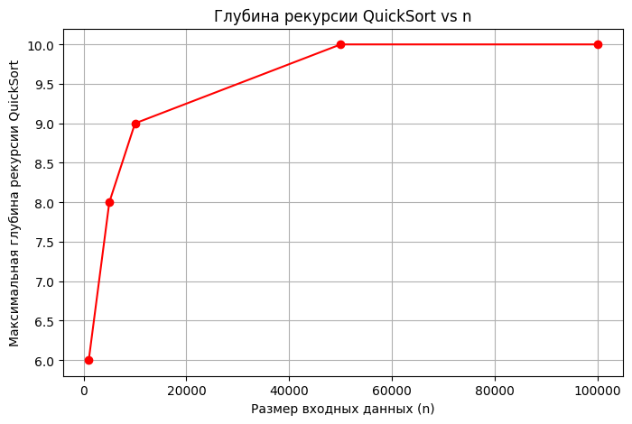

# Design and Analysis of Algorithms

Implementation and analysis of classic divide-and-conquer algorithms for course assignment.

---

# Project Report: Sorting, Selection, and Closest Pair Algorithms

## 1. Architecture Notes

In QuickSort, recursion depth is controlled by recursing only on the smaller partition and iterating on the larger one, ensuring a call stack depth of O(log n). MergeSort uses a single reusable buffer for merging, reducing memory allocations and improving performance. Both algorithms implement a cutoff to InsertionSort for subarrays of size ≤16, enhancing efficiency on small inputs.

## 2. Recurrence Analysis

**MergeSort:**  
Recurrence relation:  
T(n) = 2T(n/2) + Θ(n).  
By the Master theorem with a=2, b=2, d=1, the complexity is Θ(n log n).

**QuickSort:**  
Average case:  
T(n) = T(k) + T(n-k-1) + Θ(n), where k is a random pivot index.  
Expected time is Θ(n log n).  
Randomized pivot and recursion on the smaller part limits recursion depth.

**Deterministic Select:**  
Uses Median-of-Medians with recurrence:  
T(n) ≤ T(n/5) + T(7n/10) + Θ(n), resulting in Θ(n) time by Akra-Bazzi theorem.

**Closest Pair:**  
Recurrence:  
T(n) = 2T(n/2) + Θ(n), overall Θ(n log n).

## 3. Plots and Discussion

### Time vs Input Size


### QuickSort Recursion Depth vs Input Size



The plots show that the execution times of all algorithms increase roughly according to theoretical expectations.  
QuickSort recursion depth remains within the expected O(log n) bounds due to recursion only on the smaller partition.  
Variations in timing may be caused by CPU caching and JVM garbage collection, typical for Java applications.

## 4. Summary

Experimental results align well with theoretical time complexities and recursion depth estimates.  
Minor deviations arise from runtime environment factors such as caching and garbage collection.  
Overall, the performance confirms the effectiveness of implemented optimizations like the reusable buffer and small cutoff for InsertionSort.

---

## How to Run and Test

Tests and timing measurements are implemented in `Main.java`. To run:

```bash
java Main
